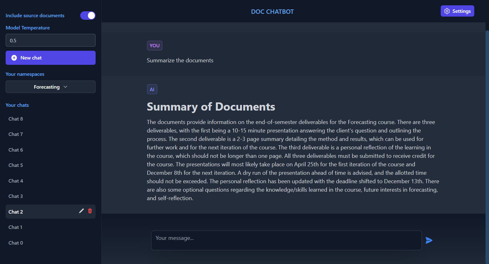
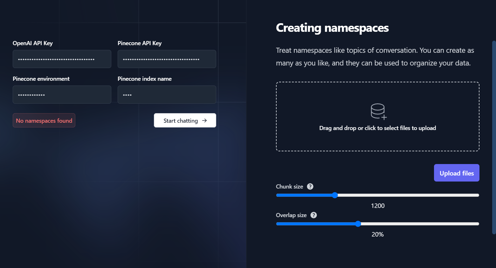

# doc-chatbot: GPT x Pinecone x LangChain

## Features

- Create **multiple** topics to chat about
- Store **any number of files** to each topic
- Create **any number of chats** (chat windows) for each topic
- Upload files, convert them to embeddings, store the embeddings in a namespace and upload to Pinecone, and delete Pinecone namespaces **from within the browser**
- Store and automatically **retrieve chat history** for all chats with local storage
- Supports `.pdf`, `.docx` and `.txt`

`+ LangChain and Pinecone`

**Main chat area**

---

**Settings page**

---